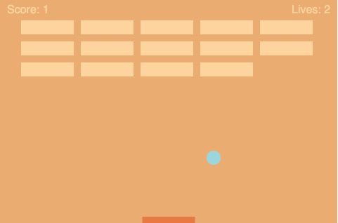

# ACS1320 Assignment - Bundling Breakout

## Breakout

I completed the [tutorial](https://developer.mozilla.org/en-US/docs/Games/Tutorials/2D_Breakout_game_pure_JavaScript) proposed by MDN which provided steps to build a complete breakout game, tracking a score and player lives. I started this project as part as the ACS1320 assignment on learning OOP, inheritance and bundling with Javascript.

To get started, download the repo and open it in a browser. 

The tools and technologies used are  **Js, html and webpack**.

